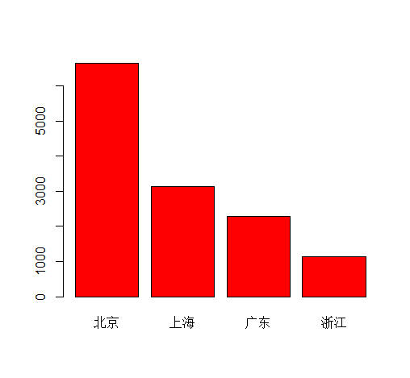
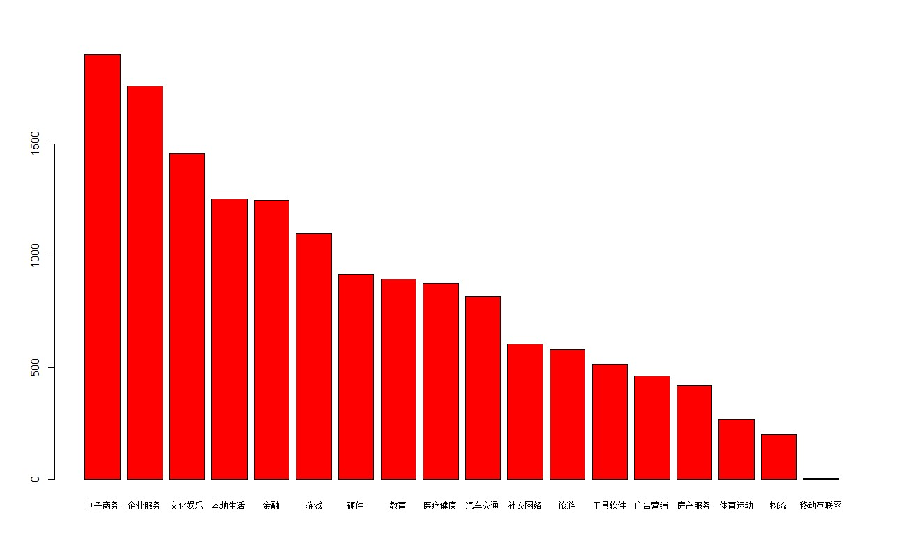

# ITjuzi

IT桔子投资事件分析
---------------

学习了Python爬虫和pandas数据分析，可以利用这些技术来做一些有趣的事，今天要做的就是对[IT桔子](https://www.itjuzi.com/)上的投资事件进行统计分析

首先从该网站爬取1999年至今的所有投资事件信息，爬虫代码见`itjuzi.py`，由于爬取数据的过程中出现了几次中断（不知道什么原因，可能是爬取太频繁），所以数据存储在好几个csv文件中，爬完之后对数据进行了整合，放在`invest_event.csv`中，爬取的投资事件共15304条。

我们看一下能从这些数据中发现什么

**最活跃的10家投资机构**

- IDG资本         489    
- 经纬中国          408   
- 红杉资本中国        371   
- 真格基金          345	
- 创新工场          262	
- 险峰长青(险峰华兴)    242	
- 腾讯            224	
- PreAngel      196	
- 达晨创投          163	
- 晨兴资本          147	

**最早的一笔投资**

date                | link                                      | company       | field    | place | round     | amount     | investor                                                 |
---|---|---|---|---|---|---|---
1999-06-07 | https://www.itjuzi.com/investevents/10241 | 搜房网-房天下 | 房产服务 | 北京  | A轮       | 数百万美元 | IDG资本  

**融资轮次前20的创业公司都有哪些**

| date                | company            | count(company) | field    | round      |
 ---------------------|--------------------|----------------|----------|------------
| 2016-09-09 00:00:00 | 滴滴出行           |             13 | 汽车交通 | 战略投资   |
| 2016-01-23 00:00:00 | 途牛旅游网         |             10 | 旅游     | IPO上市后  |
| 2014-10-03 00:00:00 | 58同城             |              9 | 本地生活 | IPO上市后  |
| 2015-11-09 00:00:00 | 酒仙网             |              8 | 电子商务 | 新三板     |
| 2016-04-13 00:00:00 | 饿了么             |              8 | 本地生活 | F轮-上市前 |
| 2016-02-04 00:00:00 | 驴妈妈旅游网       |              8 | 旅游     | 战略投资   |
| 2014-12-11 00:00:00 | PPTV聚力传媒       |              8 | 文化娱乐 | 战略投资   |
| 2016-08-19 00:00:00 | 京东               |              8 | 电子商务 | IPO上市后  |
| 2015-07-21 00:00:00 | 一嗨租车           |              8 | 汽车交通 | 战略投资   |
| 2014-11-12 00:00:00 | 优酷土豆-合一集团  |              8 | 文化娱乐 | IPO上市后  |
| 2016-04-20 00:00:00 | 美图秀秀           |              7 | 文化娱乐 | D轮        |
| 2014-03-01 00:00:00 | AeroHive艾诺威     |              7 | 硬件     | IPO上市    |
| 2014-02-01 00:00:00 | VANCL凡客诚品      |              7 | 电子商务 | F轮-上市前 |
| 2016-03-14 00:00:00 | 百姓网             |              7 | 本地生活 | 新三板     |
| 2015-08-15 00:00:00 | 明星衣橱           |              7 | 电子商务 | D轮        |
| 2014-12-11 00:00:00 | 陌陌               |              7 | 社交网络 | IPO上市    |
| 2016-09-08 00:00:00 | 百世物流(百世汇通) |              7 | 物流     | 不明确     |
| 2013-12-01 00:00:00 | UC优视科技         |              7 | 工具软件 | F轮-上市前 |
| 2015-10-21 00:00:00 | 大姨吗             |              7 | 医疗健康 | E轮        |
| 2016-07-07 00:00:00 | 趣分期(趣店集团)   |              7 | 金融     | F轮-上市前 |

**创业公司所在地分布情况**

| place  | count(place) |
 --------|--------------
| 北京   |         6639 |
| 上海   |         3124 |
| 广东   |         2280 |
| 浙江   |         1143 |
| 江苏   |          520 |
| 四川   |          357 |
| 福建   |          258 |
| 湖北   |          199 |
| 台湾   |          104 |
| 陕西   |           91 |
| 天津   |           88 |
| 重庆   |           78 |
| 山东   |           78 |
| 香港   |           76 |
| 湖南   |           56 |
| 河南   |           40 |
| 辽宁   |           36 |
| 安徽   |           34 |
| 海南   |           16 |
| 贵州   |           16 |
| 河北   |           14 |
| 内蒙古 |           11 |
| 广西   |           10 |
| 山西   |            7 |
| 黑龙江 |            6 |
| 江西   |            5 |
| 甘肃   |            4 |
| 云南   |            4 |
| 吉林   |            4 |
| 新疆   |            3 |
| 国外   |            1 |
| 宁夏   |            1 |

**创业公司最青睐的地方**

**创业公司所处的领域**

通过以上数据，我们发现获得融资次数最多的公司基本上都是互联网公司，创业者最喜欢去的地方是北京，其次是上海、广东、浙江。所以对于有志于创立一家公司的创业者，北京是首选地，其次你得是一个技术达人。
